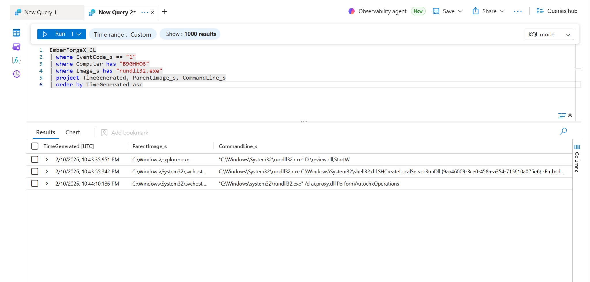
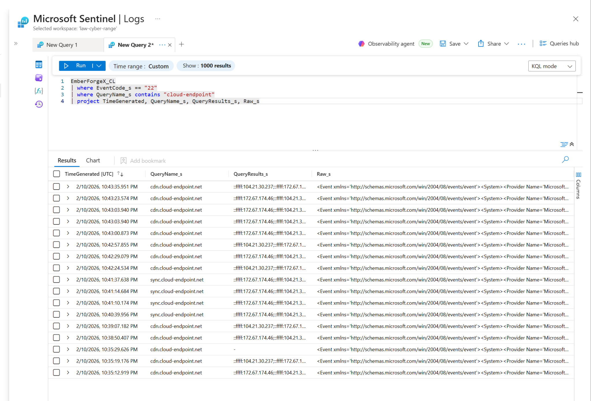
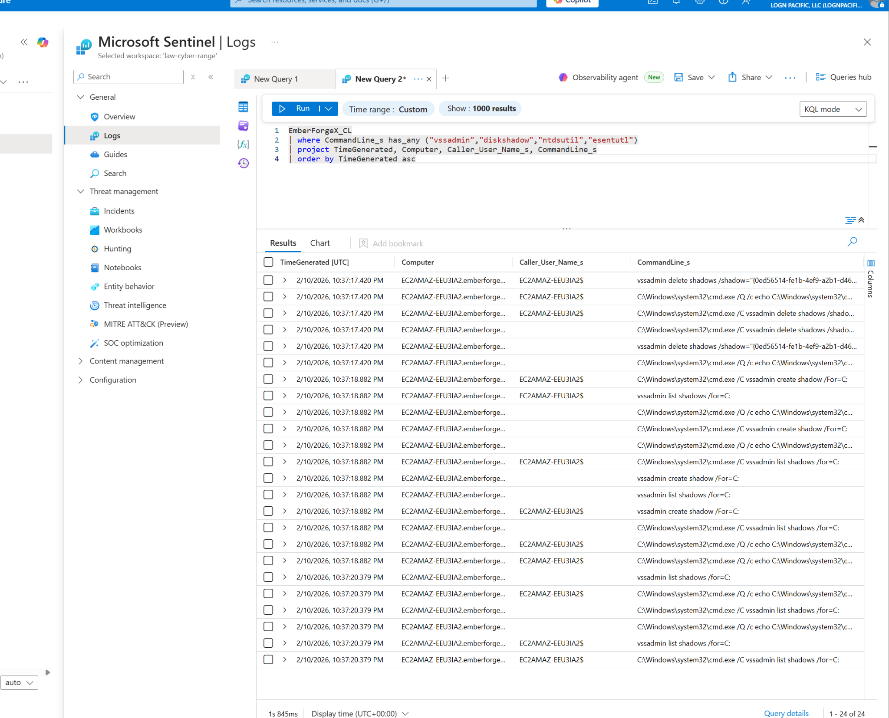
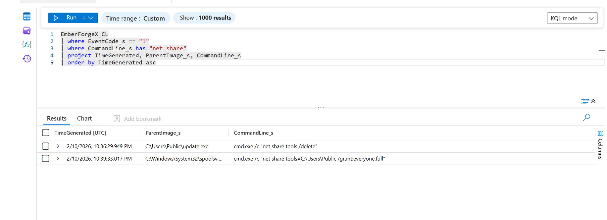
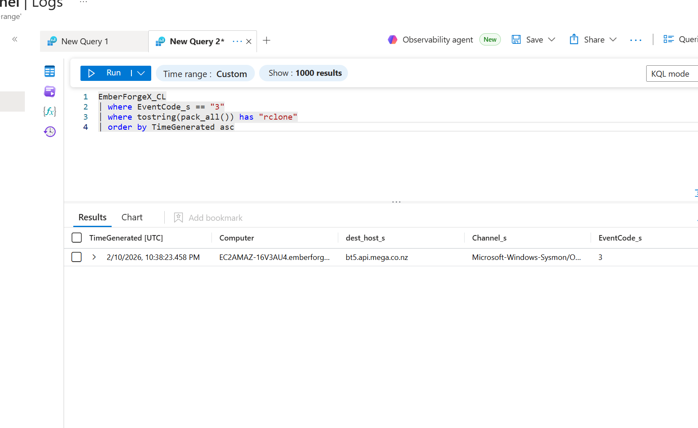
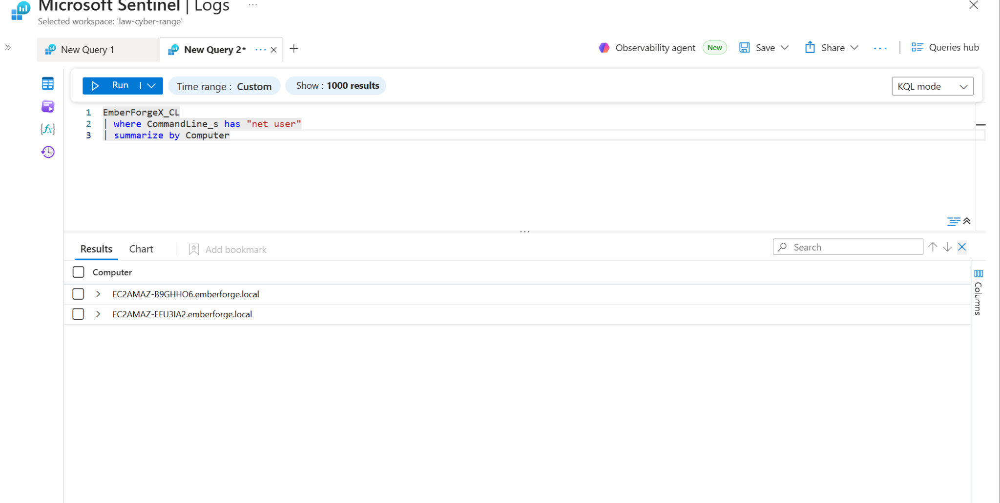

# EmberForge Threat Hunt: Active Directory Attack Investigation

This repository is a breakdown of a threat hunt I completed in Microsoft Sentinel for the **EmberForge: Source Leak** investigation. The scenario followed an attacker moving through an environment, stealing credentials, moving laterally, staging data, exfiltrating files, and establishing persistence.

I worked through all 10 phases of the hunt and solved all 44 flags. The goal of this repo is to show how I used KQL, process telemetry, event logs, and host level evidence to piece the attack together. 

## Environment

- SIEM: Microsoft Sentinel  
- Data: Sysmon + Windows Event Logs  
- Log Source: EmberForgeX_CL  
- Hosts:
  - EC2AMAZ-B9GHHO6 (workstation)
  - EC2AMAZ-16V3AU4 (server)
  - EC2AMAZ-EEU3IA2 (domain controller)

---

## What happened (attack chain)

The attacker:

- downloaded payload using certutil  
- executed via rundll32 and suspicious processes  
- dumped LSASS to steal credentials  
- enumerated users  
- moved laterally using SMB + net use  
- staged data using compression tools  
- exfiltrated using rclone to Mega  
- created account for persistence  
- installed remote access tool  
- deleted shadow copies to evade detection  

---

## Key evidence

### Initial access + execution

- certutil used for payload delivery  
- rundll32 used for execution  

---

### Credential access

- LSASS dump confirms credential theft  

---

### Lateral movement

- net use + SMB used to move between hosts  

---

### Exfiltration

- rclone used to send data externally  
- traffic tied to Mega infrastructure  

---

### Persistence

- account created + remote access established  

---

### Defense evasion

- shadow copies deleted to reduce recovery  

---

## How I approached it

- filtered process creation (EventCode 1)  
- searched command lines (certutil, rclone, net use, vssadmin, rundll32)  
- pivoted across hosts  
- rebuilt timeline using timestamps  

---

## What this shows

- ability to hunt using KQL  
- ability to follow attacker behavior across systems  
- understanding of real attack chains  
- ability to separate signal from noise  

---

## Final note

This was one of the better hands on investigations I’ve worked through because it forced me to do more than just identify single events. I had to follow the attack from host to host, understand what mattered, and connect everything back into one timeline.

That was the real value of it.
